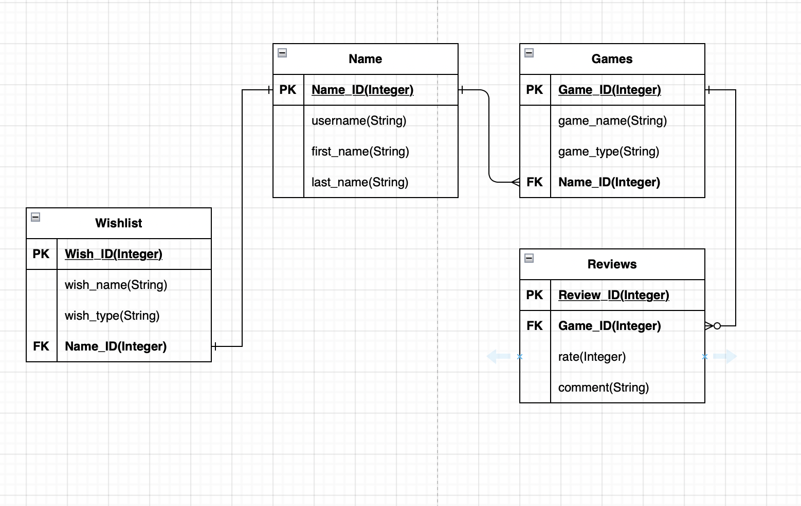

# API Webserver Project

> __R1. Identification of the problem you are trying to solve by building this particular app.__

Nowadays, we have more storage in our devices even now we don't even have to have enough space for downloading games since all platforms share cloud gaming, meaning that as long we have a strong connection to the internet we can play as many games as we wish and because we are now able to play as many games as possible we get into a point where we no longer know which games we have downloaded and not, as well if we played such a long time ago some game and we would like to remember if we like it or not, meaning that we rate and comment about different games, as well as we are always looking for games that we love to play later or buy later, we can have a wishlist where we are able to look at all those games that we would wish to have in some sorta future, this API is done a single user, meaning that there is only supposed to be one user in the API as it is for having track of your own games and not from other users.

Meaning that with this app we would be able to have all at once, as a user of the API, the list of your games, we can rate them and provide a comment about if we liked them or not, as well as watch a wishlist where we can add or delete games as we might lose interest in the future for some games or we actually got it, so we can delete it from the wishlist and add it to the games list that has downloaded.

So if someone asks you about some game, you can just look and check if you have it, or if another user is looking for someone to borrow some title, with the API you are able to check for your games if you have them in your collection. 

It is always so easy to forget about what games we have played or we have downloaded, as we might have played them a long time ago this way you can always provide feedback to other users about different games. 

It might not be a huge problem yet, but in a few years when the storage of our devices is enormous we will lose track of the games we have, we already have a nice interface and library as Xbox gave us, and how inside of the Store we can find that Wishlist Table before we will not mind, but now we have the feature we have the advantage of having our games listed, our wished games a,d comments about them in the same space. 

> __R2. Why is it a problem that needs solving?__

The gamers community is huge, everyone has different thoughts about each game and some others share the same passion for different games, and we always wondered what the other user might like as well, so we can engage with them and connect or what type of games they have downloaded or what game they would love to get.

As every solution that is provided, is with the purpose of making our life easier, the problem is that we don't know sometimes what games we have or games about our childhood that we might forget and that we actually played and commented about good or bad they used to be, there millions of games and we cannot remember each of them so we should have in mind about keeping track of our games, or our future games and about what we thought about games that we have played. 

So it will be more of a solution focused on the organization of what games we have played, what we want to play and our comments about them, as we can always check the list of games, and our comments so we can share them with our friends, and our wishlist so we can get inspired for getting that game we have been wishing for so long. 

> __R3. Why have you chosen this database system? What are the drawbacks compared to others?__

PostgreSQL was the best option for this project as we have been working throughout the semester, as a new student in Information and Technology it was my first time using a database for creating API and so far while coding I can tell that PostgreSQL was the best option as it has a really simple syntax for creating tables, reading, and dropping them, aside that it is a really extensible language that allows us to have a wide selection of data types, meaning that if we have in mind a table with different data types we can do it with PostgreSQL. 

Even though for this project we might not have used it at its all potential, since with PostgreSQL we can handle complex queries and big databases, and perfect when creating projects with object-relational and inheritance, for de development of my project this function where so helpful as all my table where related through each other, bases like MySQL are only relational databases useful as well but it might not fit for every project we might have in mind. 

PostgreSQL is a great database but as with everything it has some drawbacks, PostgreSQL focuses on compatibility, meaning that all the changes focused on speed improvement require more code than MySQL, many of the open-source app support other databases like MySQL but not all of them support PostgreSQL, talking about performance PostgreSQL is so much slower compared to other databases like MySQL. 

PostgreSQL even though can have many benefits, the complexity it provides, makes it hard to be able to progress while working as it so more complex than databases like SQL, the complexity of using it begins from the installation making it really hard for new users that might not have an idea about how to work with it, as it is not as friendly as others. When talking about high speed and storing large amounts of data, PostgreSQL will not be our option as it is so much slower compared to other databases. Talking about some other drawbacks is the memory usage and the replication inside of the database, as replicating will be as much difficult as it is on other databases, this type of things we need to have these in mind if we will like to create a project like ours using PostgreSQL, as it could be good for some projects but for some other might not fit as much as other databases can, not saying that is a bad database, is like any other language, each language fits better for different types of projects.


> __R4. Identify and discuss the key functionalities and benefits of an ORM__

An ORM or Object-Relational Mapping is a programming technic that allows developers to interact with databases using high-level objects and methods instead of writing raw SQL queries.

There is plenty of benefits to using an ORM, abstraction is one of the main key functionalities when using an ORM, since it abstracts away the way we work with the database, from creating tables, updating data and querying data. This means that we don't have to worry about how to create tables and other functions, we just have to focus on the logic of our code.

Type safety is another of the key functionalities of using an ORM, as we used typed objects to represent records, which provides safety and reduces the likelihood of errors caused by typed mistakes or mismatches. As we might have huge databases with plenty of different attributes along each table it gets really difficult to keep track of them and not make a mistake while typing, reducing the time we spend trying to check for the spell. 

The performance of an ORM can be enhanced with caching or other performance optimizations to improve the database queries performance, this can significantly improve the performance of database-driven applications, mainly when using complex queries or really large datasets, other performance optimization would be lazy loading which allows related objects to be loaded all on demand instead of one by one, reducing memory usage making a better performance of the database. Using caching and lazy loading is really helpful however their use of them can lead to complexity and issues with consistency and data integration.

Security is another key functionality provided when using an ORM by using parameterized queries to prevent SQL injection attacks. A parameterized query the user will input is separated from the same query and passed as a parameter to the database. With ORM we can also input validation to meet certain criteria such as the type of input or the range of values. This is used for preventing common security vulnerabilities such as buffer and integer overflows. 

Another function provided by an ORM would be the encryption and hashing of sensitive data as an access control mechanism to restrict access to different parts of the database and detect potential security breaches. 

One of the main benefits after being working on this project with an ORM is that instead of having to deal with a new language for manipulating the database, we can stick with Python, which we have been using during the last semester as well, allowing us to work with objects instead of the SQL queries. The productivity increased when using an ORM since it is providing a more simplified interface for us to deal with the data, reducing the amount of time while coding queries, etc. Another huge benefit of using an ORM is that it will enforce consistency since it will check that the data given matches the database data. Using an ORM makes it so much easier when creating an API since it reduces the time that we might spend trying to get the logic of the database, having the database logic separated from the same app, improves the maintainability when updating or modifying schemas.  

> __R5. Document all endpoints for your API__
```python
@app.route('/name', methods=[‘GET'])
```
This endpoint was made with the purpose of being able to see our own username so we can acknowledge if we are making further actions with our correct username. Meaning that this endpoint will return different attributes, firstly an ‘id’ primary key that will be sued in other tables for recognizing the user, then ‘username’, ‘first_name’ and ‘last_name’. 

``` python
@app.route('/game', methods=[‘GET’])
```
This endpoint returns a list of the games that we have saved inside our Game Table, giving us an ‘id’ as the primary key of the table, ‘game_name’, ‘game_type’ and ‘name_id’ foreign key, which is taken from the Name table from the first route. 

```python
@app.route('/game', methods=[‘POST'])
```
This endpoint is for posting and adding new games title to the Game table, we need to provide the ‘game_name’, ‘game_type’ and ‘name_id’ attributes for being able to add data to the Game table, following the syntax:

``` python
{
	“game_name”: “Fortnite”,
	“game_type”: “Battle Royal”,
	“user_id”: 1
}
``` 
>__Be careful when writting it as we can always make mistakes, and dont forget to use "double quotes".__
```python
@app.route('/name', methods=[‘GET'])
```
This endpoint was made with the purpose of being able to see our own username so we can acknowledge if we are making further actions with our correct username. Meaning that this endpoint will return different attributes, firstly an ‘id’ primary key that will be sued in other tables for recognizing the user, then ‘username’, ‘first_name’ and ‘last_name’. 

```python
@app.route('/game', methods=[‘GET’])
```
This endpoint returns a list of the games that we have saved inside our GAME Table, giving us an ‘id’ as the primary key of the table, ‘game_name’, ‘game_type’ and ‘name_id’ foreign key, which is taken from the NAME Table from the first route. 

```python
@app.route('/game', methods=[‘POST'])
```
This endpoint is for posting and adding new games title to the GAME Table, we need to provide the ‘game_name’, ‘game_type’ and ‘name_id’ attributes for being able to add data to the GAME Table, following the syntax:

```
{
	“game_name”: “Fortnite”,
	“game_type”: “Battle Royal”,
	“user_id”: 1
}
```
```python
@app.route('/review', methods=[‘GET’])
```
This endpoint returns the list of reviews that we have added to the REVIEW Table, having an ‘id’  primary key for each review, having also a foreign key provided by the GAME Table so we can make a relation between the GAME and REVIEW Table, also we will have the attributes rate for integers and comment if we will like to add any type of comment to our rate. 

```python
@app.route('/review', methods=[‘POST’])
```
The purpose of this endpoint is to be able to post our reviews about the games that we have stored inside the GAME Table, as it will be requested from us to give the ‘game_id’ so we can know which game we are talking about, we will have to give a ‘game_id’, rate and extra comments to the game we will be posting inside the REVIEW table. 
```
{ 
	“game_id”: 1,
	“rate”: 10,
	“comment”: “So fun” 
}
```
Be careful when making the request as we might miss one of the attributes, if so an error will be triggered for the missing attribute as it will be expecting it since is inside of the Model and of the Schema.

```python
@app.route('/update_review/<int:game_id>, methods=['PUT'])
```
We can always change of opinion about what we think about a game, as at first could not be the best but eventually it becomes such a good game, that actually end up loving it, and we will love to add the details that made you fall in love at the end, that's why it's important to create an UPDATE verb, our opinion does not have to be the same along all the game we can start loving it and end up hating it or vice versa. The main purpose of the endpoint is to be able to make updates to the reviews that have been already posted in the Review table. 

It is important to have in mind that when trying to make the request, we will have to provide the ‘game_id’ of the ‘review’ we are trying to update, and inside the body write the keys and values of the same schema in this case, we will have to write the new ‘rate’ and ‘comment’ to the body, it will not be changed if the given ‘game_id’ doesn't exist inside of the GAME Table. Syntax of the route: 
```python
@app.route('/update_review/1, methods=['PUT'])
{ 
	“rate”: 8,
	“comment”: “Not that fun after all” 
}
```
```python
@app.route('/delete_review/<int:game_id>', methods=[‘DELETE'])
```
For this endpoint is firstly required from the user gives the game_id of the review he will be deleted as we need to make sure that the ‘game_id’ given is truly inside of the GAMES Table, if it is True, the review will be deleted with no turnback however, if there is no ‘game_id’ an error will be triggered, letting us know that the review of the given ‘game_id’ does not exist, meaning two thinks that there is no such ‘game_id’ inside of the GAMES Table meaning that there will not be any kind of review for that ‘game_id’ so there will be nothing for being deleted. 

```python
@app.route('/wishlist', methods=[‘GET’])
```
This endpoint returns the list of all the games that we will like to have in the future but that at the moment we haven't downloaded, we will get back different attributes, such as wishlist game id, user_id, name of the game and the type of game the title is, so we can scroll all around the different titles we might want later. Such is a motivation for us to get all the games listed inside the table. There is no need to add any other data type, as it will be retrieving the whole list of the Table. 

```python
@app.route('/wishlist', methods=[‘POST’])
```
The purpose of this endpoint is to be able to add data to the REVIEW Table, adding games that we would love to have and that we already know that its that game the one we might get later, but just to don't lose track of it, you will like to store it inside of the list, it is needed to provide the ‘user_id’ that is making the POST, add the name of the game and the type of game it is, since these two attributes are listed and they will be expected inside the body of the request for being able to proceed your ‘POST’ request, once given the attributes we would be able to add the game title into the WISHLIST table.

```python
The syntax for the request:
{
	“wish_name”: “xxx”
	“wish_type”: “xyz”
}
```
```python
@app.route('/delete_wishlist/<string:wish_id>', methods=['DELETE'])
```
The wishlist purpose is to add games that we want to have in the future, so then what will happen once we get the game that we have been wishing for, that is the purpose of this endpoint, once we have achieved it, we will like to delete this element from our wishlist as it’s no longer a wish, we will have to provide the ‘wish_id’ so it is possible to delete the game from the table, however, it's important to have in mind the way it was added to the table since if there is actually another wishlist_id already but with another name, we will be deleting another game that we might not have yet, and that should be staying inside the WISHLIST Table

>__R6. An ERD for your app__



>__R7. Detail any third-party services that your app will use__

While working on our API for being able to interact with the database, tasks like retrieving, adding, and updating data there was the need to install some libraries that will help us to have more order and to reduce the amount of time for creating our API, even though each of the libraries is inside of our requirements.txt and we can actually know what it is needed from new users for being able to use and run the API. 

The most important thing is the library that will let us make our HTTP request, which would be Flask, it was important to import its library into our code, so we can use it and create routes for doing CRUD inside of our API, as the main task of every API is to retrieve data, it will have not to be possible if we haven't import Flask inside of our document.

SQLAlchemy, help us to create a relational database, letting attributes and tables be related to each other while using object inside of Python, without having to deal the SQL queries, which will take so much longer to manipulate when creating the API, most of the code is relied on SQLAlchemy, as it the one that allowed the Objects to be created leading to Tables and Models being created inside of the databases, not leaving behind Marshmallow which played the role of delivering those objects into the database following the correct type of data that the tables are expecting, holding the Schemas of each table, so the data matches with every single detail inside of the API. 

>__R8. Describe your project's models in terms of the relationships they have with each other__

As for this question, we will be using for example Two Models from our code to explain how our Models are related by using different functions. 

```python
class Name(db.Model):
    id = db.Column(db.Integer, primary_key=True)
    username = db.Column(db.String(50))
    first_name = db.Column(db.String(25))
    last_name = db.Column(db.String(25))
    games = db.relationship('Game', backref='name', lazy=True)
    wishlist = db.relationship('Wishlist', backref='name', lazy=True )

class Game(db.Model):
    id = db.Column(db.Integer, primary_key=True)
    game_name = db.Column(db.String(50))
    game_type = db.Column(db.String(50))
    name_id = db.Column(db.Integer, db.ForeignKey('name.id'))
    reviews = db.relationship('Review', backref='game', lazy=True)
```

Inside each table is located a variable also seen as an attribute, it will have the id = db.Column(db.Integer, primary_key=True), where ‘id’ is set for the name of the attribute, the name of the column that will be held inside of the table is located, we then have to say that it is going to be a column, with an Integer input, finally, with the function primary_key=True we are telling to the database that the ‘id’ is the Primary Key of the table since its equal to True.

Each table along our code has the code above since it was important to set a PK for each table, which will be related to other tables later, following different relationships as one-to-many or one-to-one as we can also see from the ERD provided. 

Once again we are able to see that inside the NAME Table, we have the next code db.relationship('Game', backref='name', lazy=True), in this case, the Name model has a one-to-many relationship with the GAME Model. The GAME Model has a foreign key ‘name_id’ making reference to the ‘id’ column of the NAME Model. The relationship( ) function is used for defining the relationship between Models. The backref parameter is used to specify the name of the attribute that will be added to the NAME Model, it is the opposite presentation of the relationship. The lazy parameter stands for when it should be loading the related objects via SQLAlchemy. 
```python

 class GameSchema(Schema):
    id = fields.Int()
    game_name = fields.Str()
    game_type = fields.Str()
    name_id = fields.Int()
    reviews = fields.Nested('ReviewSchema', many=True )
```

On the reviews attribute, we can see the fields.Nested, is used for Nesting another Schema as a field of the main Schema, in this case, we are trying to get the Review Schema inside of the Game Schema, so when requested by a ‘GET’ method it would be possible to see them. 

Each Table and Model was able to be related thanks to the functions mentioned above, it is important to say which would be the PK and if it will be sharing its data inside of other Models as FK, we always tell from which Table is taken and to which point we are sending it. For the creation of Models we used SQLAlchemy so it is possible to talk to the database working at the same time with the Schemas created by Marshmallow that translate the information so the database can actually know about what we are trying to do in our database 

>__R9: Explain the relationships involved in your database based on an ERD that represents the planned database__

My API is stored in a table called ‘gaming’ that is shaped into 4 tables, each of them related to at least one primary key from other tables. Each table has a PK inside as required and an FK so it is possible to have a relational database, it can be called a relational database since inside of each table there is data stored that will provide access to other data points inside other tables along our database. 

We will begin with a Name table, that has a PK called ‘id’, and attributes such as ‘username’, ‘first_name’ and ‘last_name’, from this table there is only one PK that will be related to another two tables, the Game and Wishlist tables. It is expected for the attributes to be receiving string inputs from the user since a ‘username’ will always have a mix of letters and numbers or even plain numbers. 

The relation from the Name table to Wishlist would be one-to-one as there will only be one user that will have a single wishlist, even though in the Wishlist table we will have many records, there is only one list for a single user. 

The Wishlist is shaped by storing a PK called ‘wish_id’ that will be useful as providing a unique id for each game stored inside of the table that we are going to be planning on getting, then we have attributes such as ‘game_name’, ‘game_type’ and FK provided by the Name table know as ‘id’ and registered as ‘name_id’ inside of the Wishlist table 

Then we will have another relation between the Name table and the Game table, where the PK from the Name table will be shared with the Game table so we can actually know that the user is looking at the Games that he owns, and that he has added to this table, the relation would be a one-to-many, having in mind that there is only one user that can have many games titles, and also that the games have a single owner, in this the PK from the Name table. 

The Game table has its own PK called ‘id’ so we can keep track of each game since it is expected that one user will have plenty of games, that at some point he will not know how many he has stored, each game will have a unique id from which we will be able to identify them, also the table has different attributes, such as ‘game_name’, ‘game_type’ both expecting a string from the user, finally, we will have the ‘name_id’ FK provided by the Name table. 

From the Game table, there will be another relation to our last table named Review, having in mind that each can have many reviews or not, so it will be an open option, so the relationship can be one-to-many or one-to-one that is why in our ERD the arrow is with a little dot, that stands for optional, so it will not be an exact requirement for it to be many as we also have inside of our endpoints the option to updating our reviews while playing the past posted game just case in case we change of mind. 

Inside the Review table, we will have the attributes ‘rate’, ‘comment’, and the FK provided by the Game table, assigned inside of the Review table as ‘game_id’, so we can identify which game we are talking about, the ‘rate’ attribute will be expecting an integer as we will be rating from 1 out of 10, while the ‘comment’ attribute is expecting a string input from the user, where the user will be able to give his opinion.

We are able to see each of these relationships in our ERD and we can identify tables and how they are related because of the shape of the arrow that is connecting one with the other, each head has a different meaning, as i explained above we can tell by looking at the title of the tables as well how they are connected between them, also we can tell the PK’s as they will be always located at the top of each table, while the FK can be allocated on any space, it will be more up to the design about how we can the attributes to be displayed in a different order. 

>__R10. Describe the way tasks are allocated and tracked in your projec__

- Check: [Project Managment](https://trello.com/invite/b/fDSLZLmM/ATTI7e593b460cf47f190a4ed4b3d643f805E099C834/gamingapi)